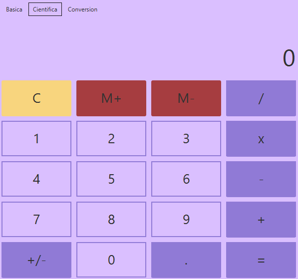

# Calculadora-Completa

Una Calculadora Basica y cientifica con opciones de convercion monetataria por medio de una API, asi como conversiones de peso y temperatura

## Calculadora Simple

    

## Calculadora cientifica

Se añaden funciones trigonometricas y exponenciales

    

## Calculadora de Conversion Monetaria

Se añade una funcion para convertir divisas de diferentes paises por medio de una API

    

## Calculadora de Conversion Unitaria

Adicionalmente la calculadora tiene una funcionalidad de conversion unitaria la cual soporta conversiones de peso y temperatura.

    

